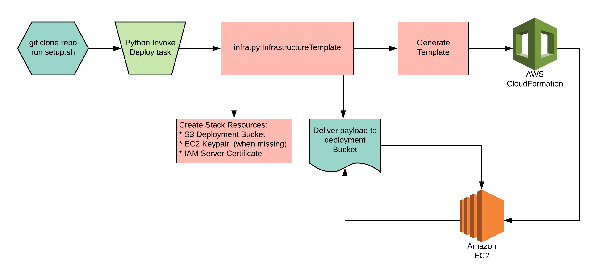

Test Deploy
===========
## A simple application deployment to AWS
### Setup
To begin, ensure you have the following
* BASH shell running in a POSIX terminal
* Python version 3.6 or greater
* AWS credentials loaded in your environment

Then run:
```bash
./setup.sh
```
Ensure this process completes without errors or warnings.

## Deployment
To create static resources, and stand-up the cloudformation stack, run
```bash
inv cfn-up
```

You can teardown previously erected stacks with,
```bash
inv cfn-down
```

You can update current stacks with,
```bash
inv cfn-update
```

## Deployment Diagram

